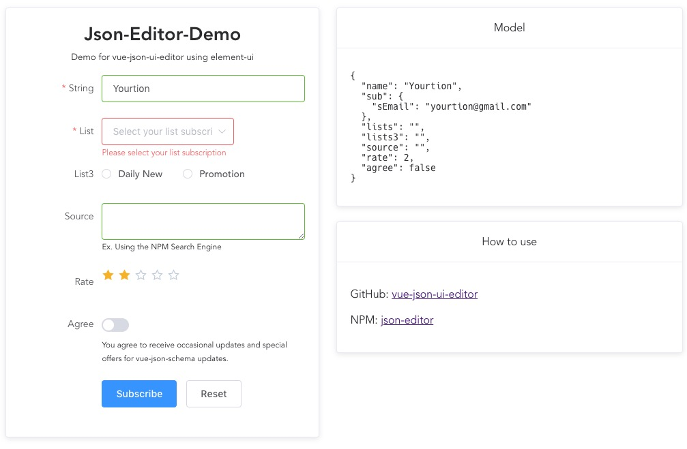

# json-editor

Edit JSON in UI form with JSON Schema and Vue.js `<json-editor>` component.



## Install

```bash
npm install vue-json-ui-editor --save
```

## Use

```Vue
<template>
<json-editor ref="JsonEditor" :schema="schema" v-model="model">
    <button @click="submit">submit</button>
    <button @click="reset">Reset</button>
</json-editor>
</template>

<script>
const SCHEMA = {
  type: 'object',
  title: 'vue-json-editor demo',
  properties: {
    name: {
      type: 'string',
    },
    email: {
      type: 'string',
    },
  },
};
// import vue-json-ui-editor
import JsonEditor from '../../src/JsonEditor.vue';
export default {
  components: { JsonEditor },
  data: () => ({
    // init json schma file ( require('@/schema/newsletter') )
    schema: SCHEMA,
    // data
    model: {
      name: 'Yourtion',
    },
  }),

  methods: {
    submit(_e) {
      alert(JSON.stringify(this.model));
    },
    reset() {
      this.$refs.JsonEditor.reset();
    },
  },
};
</script>
```

More info on: [Example-Subscription](example/components/Subscription.vue)
Schema: [newsletter.json](example/schema/newsletter.json)

## props

- `schema` ***Object*** (*required*)
The JSON Schema object. Use the `v-if` directive to load asynchronous schema.

- `v-model` ***Object*** (*optional*) `default: [object Object]`
Use this directive to create two-way data bindings with the component. It automatically picks the correct way to update the element based on the input type.

- `auto-complete` ***String*** (*optional*)
This property indicates whether the value of the control can be automatically completed by the browser. Possible values are: `off` and `on`.

- `no-validate` ***Boolean*** (*optional*)
This Boolean attribute indicates that the form is not to be validated when submitted.

- `input-wrapping-class` ***String*** (*optional*)
Define the inputs wrapping class. Leave `undefined` to disable input wrapping.

## data

- `default`
 *initial value:* `[object Object]`

- `fields`
 *initial value:* `[object Object]`

- `error`
 *initial value:* `null`

- `data`
 *initial value:* `[object Object]`

## events

- `input` Fired synchronously when the value of an element is changed.

- `change` Fired when a change to the element's value is committed by the user.

- `invalid` Fired when a submittable element has been checked and doesn't satisfy its constraints. The validity of submittable elements is checked before submitting their owner form, or after the `checkValidity()` of the element or its owner form is called.

- `submit` Fired when a form is submitted

## methods

- `input(name)`
Get a form input reference

- `form()`
Get the form reference

- `checkValidity()`
Checks whether the form has any constraints and whether it satisfies them. If the form fails its constraints, the browser fires a cancelable `invalid` event at the element, and then returns false.

- `reset()`
Reset the value of all elements of the parent form.

- `submit(event)`
Send the content of the form to the server

- `setErrorMessage(message)`
Set a message error.

- `clearErrorMessage()`
clear the message error.
