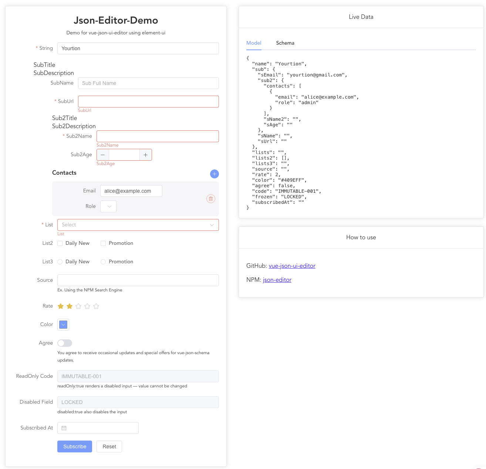

[![NPM version][npm-image]][npm-url]
[![npm download][download-image]][download-url]
[![npm license][license-image]][license-url]

[npm-image]: https://img.shields.io/npm/v/vue-json-ui-editor.svg?style=flat-square
[npm-url]: https://npmjs.org/package/vue-json-ui-editor
[download-image]: https://img.shields.io/npm/dm/vue-json-ui-editor.svg?style=flat-square
[download-url]: https://npmjs.org/package/vue-json-ui-editor
[license-image]: https://img.shields.io/npm/l/vue-json-ui-editor.svg?style=flat-square
[license-url]: https://github.com/yourtion/vue-json-ui-editor/blob/main/LICENSE

# json-editor

A Vue 3 JSON Schema based form editor component. Edit JSON in UI form with JSON Schema and [element-plus](https://element-plus.org/), with full TypeScript support.



## Versions & Branches

本仓库通过不同分支维护多个 Vue 版本的发布。请根据你的 Vue 版本选择对应分支：

| Branch | Version | Vue | UI Library | Status |
|--------|---------|-----|------------|--------|
| [`main`](.) | 3.x | Vue 3 (`^3.5.0`) | [element-plus](https://element-plus.org/) (`^2.11.1`) | ✅ Active |
| [`master`](../tree/master) | 2.x | Vue 2 (`^2.7.16`) | [element-ui](https://element.eleme.io/) (`^2.15.14`) | 🛠️ Maintenance |
| [`v1`](../tree/v1) | 1.x | Vue 2 (`^2.5.17`) | element-ui (`^2.4.11`) | ⚰️ Legacy |

> - `main` 为当前默认分支，对应 npm `3.x`（Vue 3 + element-plus）。
> - 如果你使用 Vue 2，请切换到 [`master`](../tree/master) 分支（npm `2.x`）。
> - 历史的 Vue 2 早期版本（npm `1.x`）请见 [`v1`](../tree/v1) 分支。

## Install

```bash
npm install vue-json-ui-editor
# or
pnpm add vue-json-ui-editor
```

> `vue-json-ui-editor` 3.x targets **Vue 3** and is designed to work with [element-plus](https://element-plus.org/).
> For **Vue 2**, see the [`master`](../tree/master) (2.x) or [`v1`](../tree/v1) (1.x) branch.

## Use

```vue
<template>
  <json-editor ref="jsonEditorRef" :schema="schema" v-model="model">
    <el-button type="primary" @click="submit">Submit</el-button>
    <el-button @click="reset">Reset</el-button>
  </json-editor>
</template>

<script setup lang="ts">
import { ref } from 'vue';
import JsonEditor from 'vue-json-ui-editor';

const schema = {
  type: 'object',
  title: 'vue-json-editor demo',
  properties: {
    name: { type: 'string' },
    email: { type: 'string' },
  },
};

const model = ref({ name: 'Yourtion' });
const jsonEditorRef = ref<InstanceType<typeof JsonEditor>>();

function submit() {
  // jsonEditorRef.value?.form() returns the underlying element-plus form instance
  jsonEditorRef.value?.form().validate((valid: boolean) => {
    if (!valid) {
      jsonEditorRef.value?.setErrorMessage('Please fill out the required fields');
    }
  });
}

function reset() {
  jsonEditorRef.value?.reset();
}
</script>
```

> `json-editor` renders with native HTML elements by default. To style it with
> **element-plus**, register the components via the static `JsonEditor.setComponent(type, component, option?)` API — see the [example](example/components/Subscription.vue).
>
> Complete working example: [example/components/Subscription.vue](example/components/Subscription.vue)
> Schema: [example/schema/newsletter.json](example/schema/newsletter.json)

## props

- `schema` ***Object*** (*required*)
The JSON Schema object. Use the `v-if` directive to load asynchronous schema.

- `v-model` / `modelValue` ***Object*** (*optional*) `default: {}`
Two-way binding for the form data. In Vue 3, `v-model` binds to the `modelValue` prop.

- `auto-complete` ***String*** (*optional*)
Whether the value of the control can be automatically completed by the browser. Possible values: `off`, `on`.

- `no-validate` ***Boolean*** (*optional*) `default: false`
Indicates that the form is not to be validated when submitted.

- `input-wrapping-class` ***String*** (*optional*)
Wraps each field's controls in a `<div class="...">`. Leave `undefined` to disable input wrapping.

- `components` ***Object*** (*optional*) `default: undefined`
Per-instance component overrides. When provided, these are merged over the global defaults registered via `JsonEditor.setComponent`, so multiple `<json-editor>` instances on the same page can each use a different UI library without polluting each other. Keys are element types (e.g. `text`, `select`, `form`, `label`); values may be a full `{ component, option }` config or a shorthand component name/object. Leave `undefined` to fall back to the global registry.

```js
// Two editors on the same page, each with its own text widget:
<json-editor :schema="a" :components="{ text: CompA }" />
<json-editor :schema="b" :components="{ text: CompB }" />
```

## events

- `update:modelValue` Emitted (for `v-model`) whenever a field value changes.

- `change` Fired when a change to an element's value is committed by the user.

- `submit` Fired when the form is submitted and passes validation.

- `invalid` Fired when a submittable element has been checked and doesn't satisfy its constraints.

## methods

Exposed via a template `ref` to the `<json-editor>` instance (e.g. `jsonEditorRef.value`):

- `input(name)`
Get a form input reference.

- `form()`
Get the rendered form component instance (e.g. the element-plus `el-form`), so you can call `.validate()` / `.resetFields()` on it.

- `checkValidity()`
Checks whether the form satisfies its constraints. Returns `boolean`.

- `validate()`
Async validation shortcut — delegates to the underlying form component's `validate()` when available.

- `reset()`
Reset the value of all elements of the form to the initial `modelValue`.

- `setErrorMessage(message)`
Set an error message (rendered via the `error` component type).

- `clearErrorMessage()`
Clear the error message.

- `getFields()`
Return the current parsed field tree (including `$sub` containers for nested objects).

- `vm`
The reactive view-model (`{ model, fields, error }`), for advanced consumers and option-callback access.

## static API

- `JsonEditor.setComponent(type, component, option?)`
Register a Vue component (or native tag name) for a given field/element `type` (e.g. `form`, `label`, `email`, `text`, `select`, `error`, …). `option` may be a plain object or a factory callback `({ vm, field, item }) => propsObject`. This is how you wire the editor to a UI library like element-plus.

```js
JsonEditor.setComponent('text', 'el-input');
JsonEditor.setComponent('form', 'el-form', ({ vm }) => ({ model: vm.model, rules: {} }));
JsonEditor.setComponent('error', 'el-alert', ({ vm }) => ({ type: 'error', title: vm.error }));
```

> **Note on `label` with element-plus:** `el-form-item` reads its label text from the `label` prop (not the default slot), so the `label` registration callback must return `label: field.label` in addition to `prop: field.name`. See [example/components/Subscription.vue](example/components/Subscription.vue).

### Wiring specific widgets via schema `attrs`

The widget for a field is chosen by `attrs.type` in its schema property (the editor reads `schema.attrs` as the field descriptor). Register the type once with `setComponent`, then drive it from the schema:

```js
JsonEditor.setComponent('switch', 'el-switch');
JsonEditor.setComponent('date', 'el-date-picker');
// schema:
{ active: { type: 'boolean', attrs: { type: 'switch' } } }
{ createdAt: { type: 'string', format: 'date-time', attrs: { type: 'date' } } }
```

### Schema features

- `disabled: true` and `readOnly: true` on a property disable/readonly the rendered input (readOnly also implies disabled).
- Nested objects (`type: 'object'` with `properties`) render in a sub-container with the object's `title` (`.sub-title`) and `description` (`.sub-description`).
- Object arrays (`type: 'array'` with `items: { type: 'object', properties }`) render as an editable list of sub-form rows. Each array renders a header (field label + add button, `.json-editor-array-header`) and one row per item (`.json-editor-array-row` with the item's sub-fields + a remove button). The add/remove buttons are registered via the `arrayadd` / `arrayremove` component types (default native `<button>`; register as `el-button` / icon buttons for UI library styling — see [example/components/Subscription.vue](example/components/Subscription.vue)). Arrays work at any nesting depth, including inside nested objects.
- Choice arrays (`array` + `enum`/`oneOf`/`anyOf`) render as a single `select` / radio group / checkbox group.

### Advanced: reusing the array renderer

The object-array add/remove logic is extracted into a standalone, framework-agnostic module so it can be reused or unit-tested in isolation:

```ts
import { createArrayRenderer, type ArrayRendererDeps } from 'vue-json-ui-editor';

const renderer = createArrayRenderer({
  model, onChange, getComp, resolveComp, elementOptions, wrapChild, renderInput,
} satisfies ArrayRendererDeps);
renderer.render(field, fieldName);   // → vnode[] for the whole array (header + rows)
renderer.addRow(fieldName);
renderer.removeRow(fieldName, index);
```

`ArrayRendererDeps` declares exactly what the renderer needs (a reactive `model`, an `onChange` notifier, and the component-resolution helpers), so it isn't coupled to `JsonEditor`'s setup closure.

## TypeScript

This package ships with bundled type declarations. You can import types directly:

```ts
import JsonEditor, { type JsonSchema } from 'vue-json-ui-editor';
// newly exported types (v3.1+):
import type {
  JsonEditorStatic,   // the setComponent static method signature
  JsonEditorInstance, // exposed instance methods (form/validate/reset/getFields/vm)
  ComponentConfig, OptionContext, VmContext, ComponentsMap,
  ArrayRendererDeps,  // for createArrayRenderer
} from 'vue-json-ui-editor';
```

## Development

```bash
pnpm install      # install dependencies
pnpm dev          # start the example app (Vite)
pnpm build:lib    # build the publishable library bundle
pnpm test         # run unit tests (Vitest)
pnpm check        # type-check + format + test
```

## License

[MIT](LICENSE) © Yourtion
